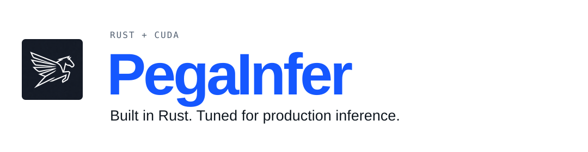
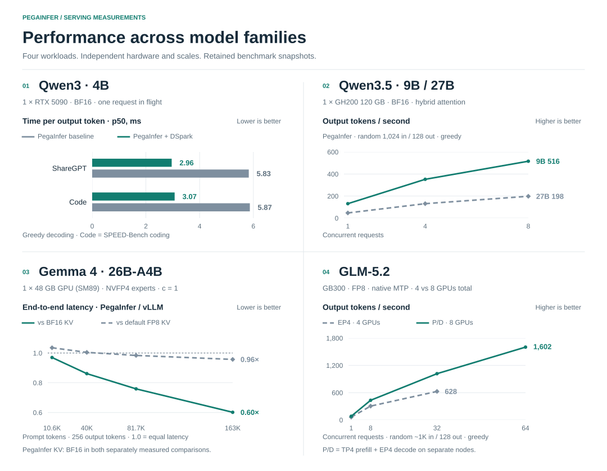
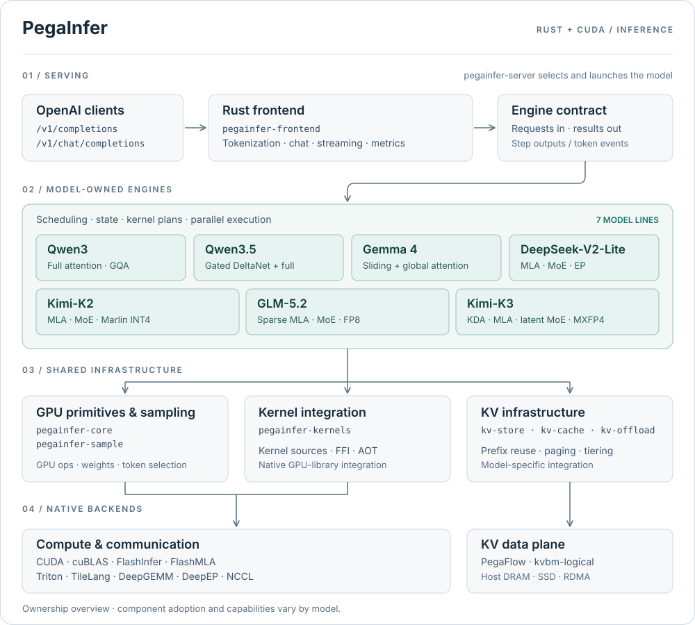

<p align="center">
  <picture>
    <source media="(max-width: 600px) and (prefers-color-scheme: dark)" srcset="docs/assets/banner-mobile-dark.svg">
    <source media="(max-width: 600px)" srcset="docs/assets/banner-mobile-light.svg">
    <source media="(prefers-color-scheme: dark)" srcset="docs/assets/banner-dark.svg">
    
  </picture>
</p>

<p align="center">
  <a href="https://pegainfer.org/">
    
  </a>
  <a href="https://join.slack.com/t/openinferhq/shared_invite/zt-41scnc53a-d0McNJDjK2lVqFGoSLUgXA">
    
  </a>
  <a href="LICENSE">
    
  </a>
</p>

<p align="center">
  <a href="#quickstart">Quickstart</a> &middot;
  <a href="#performance">Performance</a> &middot;
  <a href="#supported-models">Models</a> &middot;
  <a href="#architecture">Architecture</a> &middot;
  <a href="#api">API</a> &middot;
  <a href="#development">Development</a>
</p>

PegaInfer serves LLMs through an OpenAI-compatible API. Each model owns its scheduler, state, and kernels; serving and KV infrastructure are shared. No PyTorch or Python runtime.

## Quickstart

### Prebuilt binary · Qwen3 on Linux

The Qwen3-only release bundles CUDA 13 and cuBLAS. It requires **Linux x86_64**, an NVIDIA GPU with compute capability **8.x–12.x**, driver **580+**, glibc **2.35+**, and OpenSSL **3**. Model weights are downloaded separately.

```bash
curl -fsSL https://raw.githubusercontent.com/pegainfer-project/pegainfer/main/install.sh | bash
```

Download [Qwen3-4B](https://huggingface.co/Qwen/Qwen3-4B) into `models/Qwen3-4B`, then start the server:

```bash
pegainfer --model-path models/Qwen3-4B
```

The server listens on port **8000**. If the command is not on your shell's path:

```bash
export PATH="$HOME/.local/bin:$PATH"
```

The installer selects the latest release by default. `PEGAINFER_VERSION` selects an exact version; see [releases](https://github.com/pegainfer-project/pegainfer/releases).

### Build from source

Use the Rust toolchain pinned in [rust-toolchain.toml](rust-toolchain.toml), a CUDA Toolkit with `nvcc` and cuBLAS, and a compatible NVIDIA driver. The default Qwen3 build needs no Python. Its driver floor is R545 / CUDA 12.3; newer toolkits and model-specific kernels can require a newer driver.

From the repository root, with the checkpoint downloaded:

```bash
export CUDA_HOME=/usr/local/cuda
cargo run --release -- --model-path models/Qwen3-4B
```

Always use **`--release`** for GPU builds. The server entrypoint is `pegainfer-server`; model crates contain the model implementation and diagnostics.

<details>
<summary><strong>Feature builds and environment options</strong></summary>

Qwen3.5 uses Triton AOT kernels, requiring Python and Triton at build time:

```bash
uv venv
uv pip install triton
export PEGAINFER_TRITON_PYTHON=.venv/bin/python
cargo run --release --features qwen35 -- --model-path models/Qwen3.5-4B
```

| Variable | Purpose |
| --- | --- |
| `CUDA_HOME` | CUDA Toolkit location; defaults to `/usr/local/cuda` |
| `PEGAINFER_CUDA_SM` | Target GPU architecture when it cannot be detected, e.g. `120` |
| `PEGAINFER_TRITON_PYTHON` | Python interpreter for Qwen3.5 Triton AOT compilation |
| `PEGAINFER_QWEN35_GDN_AOT_BUNDLE` | Build-time FlashInfer GDN candidate directory; serving requires explicit backend selection |
| `PEGAINFER_TILELANG_PYTHON` | Python interpreter for K3 TileLang kernel generation |

Qwen3.5 defaults to Triton even when a FlashInfer GDN candidate is linked. Explicit `--qwen35-gdn-backend flashinfer-candidate` selection requires SM120/Hv32/TP1 and fails on unsupported or unavailable candidates. Generation and production gates are described in the [candidate README](pegainfer-kernels/tools/flashinfer_gdn/README.md).

Other model lines have their own hardware and build requirements; follow the model guides below. Run `cargo run --release -- --help` for the compiled-in CLI.

</details>

<details>
<summary><strong>Windows source builds</strong></summary>

```powershell
$env:CUDA_PATH = "C:\Program Files\NVIDIA GPU Computing Toolkit\CUDA\v12.x"
cargo run --release -p pegainfer-server -- --model-path models/Qwen3-4B

# Qwen3.5 additionally needs Triton at build time
uv venv .venv --python 3.12
uv pip install "triton-windows<3.7"
$env:PEGAINFER_TRITON_PYTHON = ".venv\Scripts\python.exe"
cargo run --release --features qwen35 -- --model-path models/Qwen3.5-4B
```

</details>

## Performance

Selected serving measurements across dense, hybrid-attention, and MoE models. Each panel uses its own hardware, workload, and scale; the linked reports preserve the benchmark conditions.

<p align="center">
  <picture>
    <source media="(prefers-color-scheme: dark)" srcset="docs/assets/performance-dark.svg">
    
  </picture>
</p>

| Panel | Measurement and source |
| --- | --- |
| **Qwen3 · 4B** | [DSpark vs PegaInfer baseline](docs/models/qwen3/serving-performance.md#dspark-speculative-decoding), single-request greedy decoding on ShareGPT and SPEED-Bench coding. |
| **Qwen3.5 · 9B / 27B** | [GH200 concurrency sweep](https://pegainfer.org/models/qwen35/#gh200-08b-2b-9b-and-27b), revision `ffb959c4`, random 1,024-token prompts and 128-token outputs. |
| **Gemma 4 · 26B-A4B** | [Four-round long-context report](https://github.com/pegainfer-project/pegainfer/issues/758#issuecomment-5551665113). Ratios use reported median end-to-end latencies; PegaInfer uses BF16 KV in both comparisons. The BF16 and default-FP8 vLLM comparisons were measured separately using PegaInfer revisions `e7a41975` and `ea02a9f7`, respectively. |
| **GLM-5.2** | [Native MTP serving sweep](https://pegainfer.org/models/glm52/#performance): co-located EP4 uses **4 GPUs**; disaggregated TP4 prefill + EP4 decode uses **8 GPUs total**. |

<details>
<summary><strong>Qwen3 serving footprint and additional measurements</strong></summary>

Qwen3-4B on one RTX 5090, BF16, TP1: PegaInfer **`70888b2`** vs **vLLM 0.24.0**, loaded and serving the same model. PegaInfer is one process; the vLLM figure sums its process tree. This is a separate snapshot from the DSpark panel above.

| Metric | PegaInfer | vLLM 0.24.0 |
| --- | ---: | ---: |
| Resident memory, loaded and idle | **771 MB** | 3814 MB |
| Startup to HTTP ready, cold | **2.99 s** | 70.0 s |
| Startup, warm compile cache | **~3.0 s** | 32.7 s |

The [Qwen3 serving report](docs/models/qwen3/serving-performance.md) also covers the 8B model, warm-prefix TTFT, host-tier restore, and the serving sweep against vLLM. Further reports cover [DSpark vs matched DFlash](docs/models/qwen3/dspark-integration.md), [DFlash serving](docs/models/qwen3/dflash-speculative-decoding.md), and [Gemma 4 12B long-context performance](https://pegainfer.org/models/gemma4/).

</details>

## Supported Models

Only **`qwen3`** is enabled by default, including in the prebuilt binary. Build other lines with `--features <feature>`. At launch, `--model-path` selects a checkpoint and its `config.json` identifies the model family.

| Model line | Attention / experts | Cargo feature | Serving scope and guide |
| --- | --- | --- | --- |
| **Qwen3 · dense 0.6B to 32B** | Full attention, GQA | `qwen3` · default | Greedy + sampling, tensor parallel, prefix cache, KV offload; DFlash / DSpark on 4B. [Model page](https://pegainfer.org/models/qwen3-4b/) |
| **Qwen3.5 · dense 0.8B to 27B** | Gated DeltaNet + full attention | `qwen35` | Text-only BF16; build-time Triton. [Model page](https://pegainfer.org/models/qwen35/) |
| **Gemma 4 · 12B and 26B-A4B** | Sliding-window + global attention; NVFP4 routed experts on 26B | `gemma4` | Text-only, single GPU, batched decode and optional chunked prefill. [Model page](https://pegainfer.org/models/gemma4/) |
| **DeepSeek-V2-Lite** | MLA + MoE | `deepseek-v2-lite` | 2-GPU EP2 correctness path. [Status and limits](docs/models/deepseek-v2-lite/status.md) |
| **Kimi-K2 / K2.5** | MLA + MoE, Marlin INT4 | `kimi-k2` | 8-GPU expert parallelism. [Model roadmap](docs/models/kimi-k2/roadmap.md) |
| **GLM-5.2** | Sparse MLA + MoE, FP8 | `glm52` | Blackwell; EP decode, TP4 prefill, native MTP speculative decoding, P/D disaggregation. Bring-up. [Model page](https://pegainfer.org/models/glm52/) |
| **Kimi-K3** | KDA + MLA, latent MoE, MXFP4 | `k3` | Text-only, Blackwell, EP and DSpark. Bring-up. [Model guide](docs/models/k3/bring-up.md) |

Capabilities and maturity differ by model. Quantized formats are model-specific; the Qwen paths listed here use BF16. DeepSeek-V2-Lite's retained correctness and benchmark gates are documented separately from production readiness.

## Architecture

**Share the infrastructure; let each model own its execution.** The frontend submits requests through an engine contract. Model schedulers decide how to batch work, manage state, and execute kernels on their target hardware.

<p align="center">
  <picture>
    <source media="(prefers-color-scheme: dark)" srcset="docs/assets/architecture-dark.svg">
    
  </picture>
</p>

The diagram shows ownership layers. Model engines select the components they need; cache integration and parallel strategies vary by model.

[Editable diagram source](docs/assets/architecture.drawio)

| Boundary | Responsibility |
| --- | --- |
| [`pegainfer-server`](pegainfer-server) | Detect the model, validate its CLI, and launch the selected engine |
| [`pegainfer-frontend`](pegainfer-frontend) | OpenAI protocol, tokenization, chat templates, streaming, metrics, and engine contracts; uses vLLM's Rust frontend crates |
| **Per-model crates** | Weights, scheduler, prefill/decode execution, state layout, and parallel strategy |
| [`pegainfer-core`](pegainfer-core) / [`pegainfer-sample`](pegainfer-sample) | Shared GPU and weight-loading primitives; batched token selection |
| [`pegainfer-kernels`](pegainfer-kernels) | Native kernels, FFI, GPU-library integration, and feature-gated AOT builds |
| **KV infrastructure** | [`pegainfer-kv-store`](pegainfer-kv-store) and the existing [`pegainfer-kv-cache`](pegainfer-kv-cache) / [`pegainfer-kv-offload`](pegainfer-kv-offload) paths; PegaFlow supplies host, SSD, and RDMA storage/transfer |

The step-based contract and legacy `EngineHandle` contract currently coexist. See the [frontend architecture](docs/subsystems/frontend/frontend-architecture.md) for the migration boundary and [design direction](docs/roadmap/direction.md) for the reasoning behind model-owned engines.

## API

Point an OpenAI-compatible client at **`http://localhost:8000/v1`**. Both `/v1/completions` and `/v1/chat/completions` support streaming.

```bash
curl -s http://localhost:8000/v1/completions \
  -H "Content-Type: application/json" \
  -d '{"model":"models/Qwen3-4B","prompt":"The capital of France is","max_tokens":32}'

curl -N http://localhost:8000/v1/chat/completions \
  -H "Content-Type: application/json" \
  -d '{"model":"models/Qwen3-4B","messages":[{"role":"user","content":"Write a haiku about Rust."}],"max_tokens":64,"stream":true}'
```

The model guides document supported sampling fields and model-specific limits. [Documentation](https://pegainfer.org/) covers the serving interface; [metrics and dashboards](docs/subsystems/frontend/prometheus-metrics.md) cover observability.

## Development

[`scripts/setup_dev.sh`](scripts/setup_dev.sh) prepares a fresh NVIDIA Ubuntu host using the pinned Rust toolchain and build dependencies. CUDA must already be installed. Container development is documented in [docker/README.md](docker/README.md).

```bash
bash scripts/setup_dev.sh
```

Run checks in release mode; accuracy and integration tests need a GPU and model weights:

```bash
cargo test --release --workspace --lib

PEGAINFER_TEST_MODEL_PATH=models/Qwen3-4B \
  cargo test --release -p pegainfer-qwen3 --test hf_golden_gate

PEGAINFER_TEST_MODEL_PATH=models/Qwen3.5-4B \
  cargo test --release -p pegainfer-qwen35 --features qwen35 --lib executor::hf_golden_gate -- --test-threads=1

PEGAINFER_TEST_MODEL_PATH=models/Qwen3.5-4B \
  cargo test --release -p pegainfer-qwen35 --features qwen35 --test e2e_scheduler
```

Browse the [engineering docs index](docs/index.md) for model-specific gates, [profiling](docs/playbooks/profiling-guide.md), and [benchmark methodology](docs/playbooks/bench-vs-vllm.md).

The [getting started guide](https://pegainfer.org/getting-started/) and model pages live at pegainfer.org. Read the engineering stories at [pegainfer.org/blog](https://pegainfer.org/blog/): [weight loading](https://pegainfer.org/blog/weight-loading/), [speculative decoding](https://pegainfer.org/blog/speculative-decoding/), [CUDA graph export](https://pegainfer.org/blog/cuda-graph-export/), and [prefill/decode overlap](https://pegainfer.org/blog/green-ctx/).

## License

[Apache-2.0](LICENSE). See [NOTICE](NOTICE) for third-party attributions. The Dynamo-derived `kvbm/kvbm-logical` crate retains its original Apache-2.0 headers and [NVIDIA Dynamo notice](NOTICE_DYNAMO).
